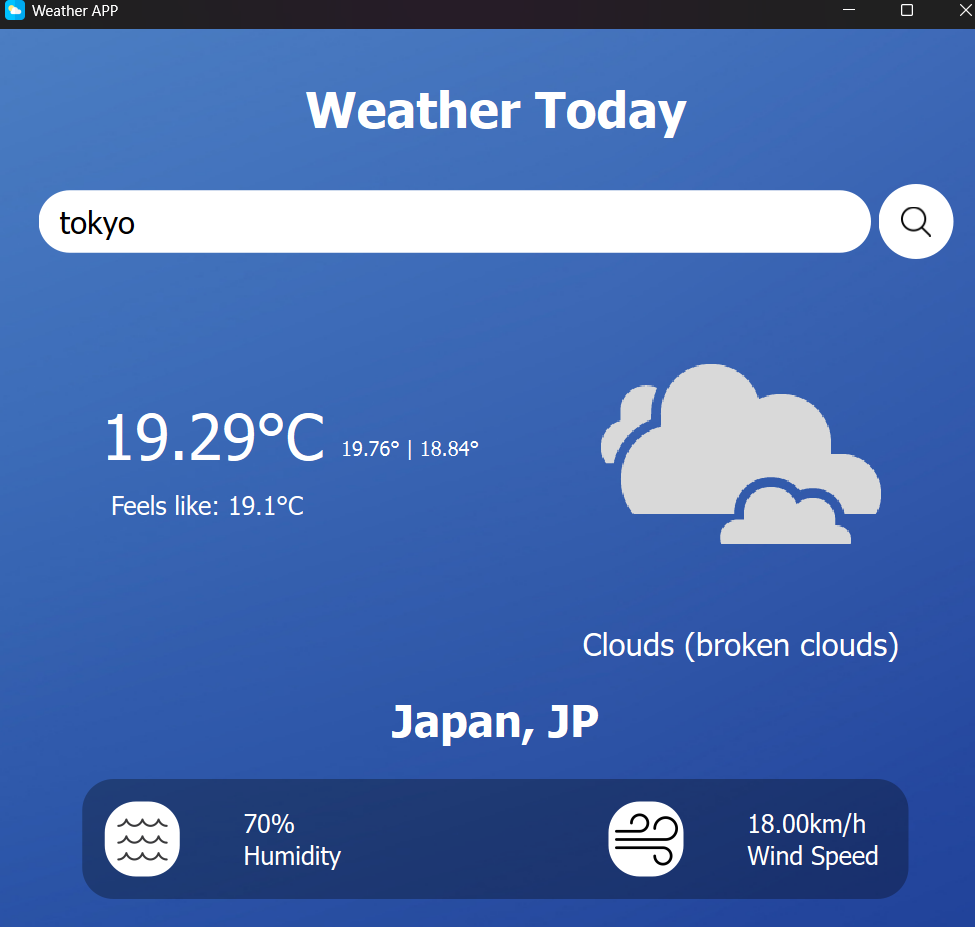
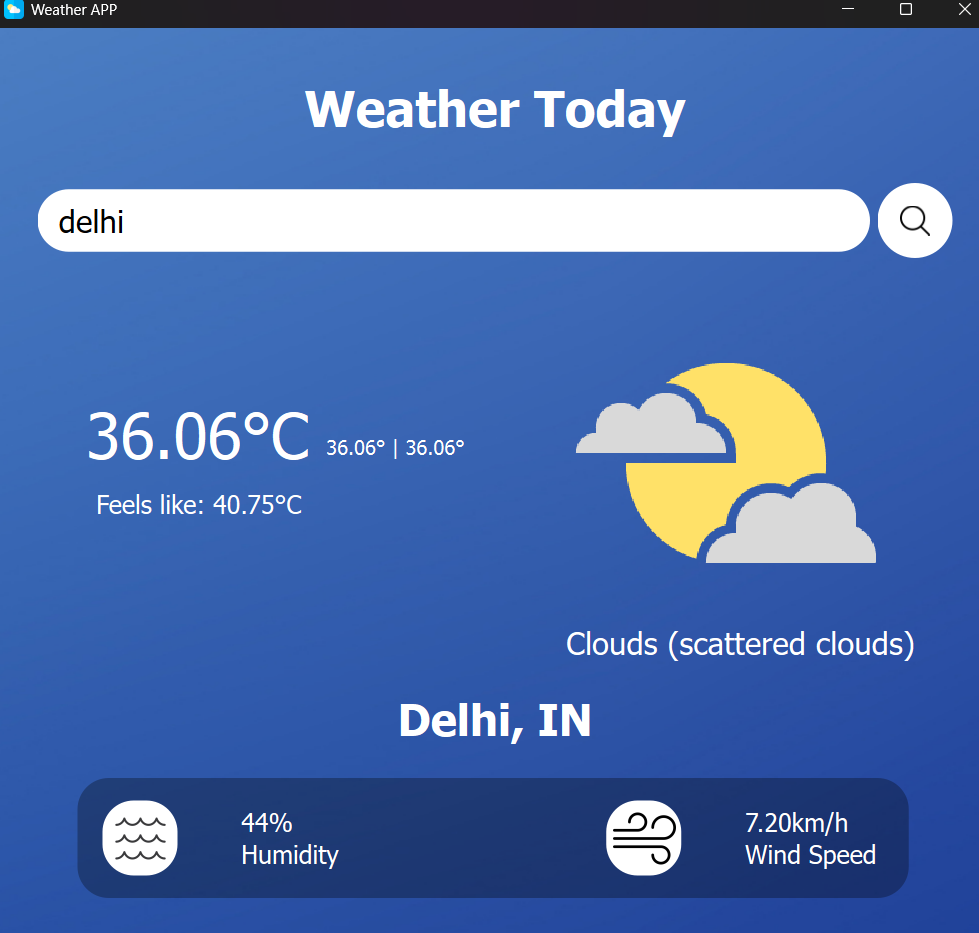
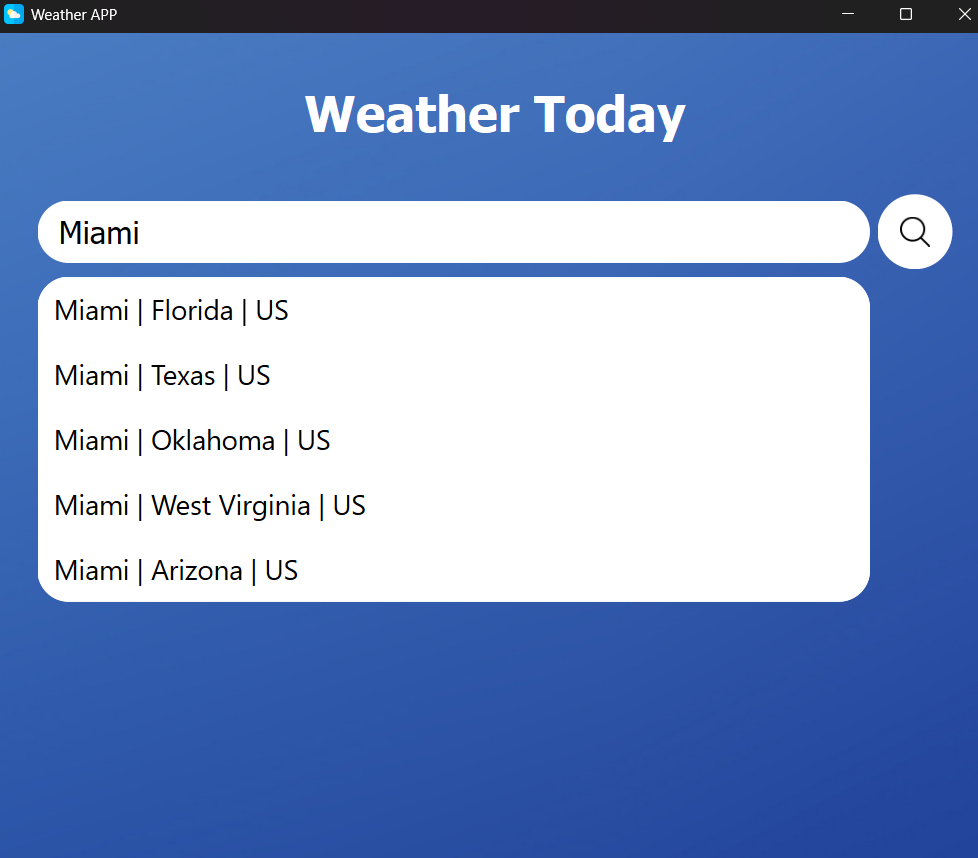

# Weather App
## #Python, #PyQt6, #Openweathermap API
Interactive weather app with modern UI, made using PyQt6 in python which show real-time weather updates of a place. Uses the API of [openweathermap.org](https://openweathermap.org/) for weather data and geocoding.

#### WORKS ONLY ON WINDOWS, LINUX AND MAC OS. 

## Usage :
### 1) Using executable file
Download the WeatherApp.exe file along with the icons folder and place them in the same folder.
<br/>
Run the executable file.
<br/>

Does not require python to be installed on the machine.

### 2) Using python file
Download main.py and icons folder and place them in the same folder.
<br/>

Install the latest version of python from [python.org](https://www.python.org/)
<br/>

Install the following python libraries :<br/>

```bash
pip install PyQt6
```
```bash
pip install requests
```
Generate your own API key from [openweathermap.org](https://openweathermap.org/api) and set the api_key variable in the main() function to that key
___

### Screenshots :
___



